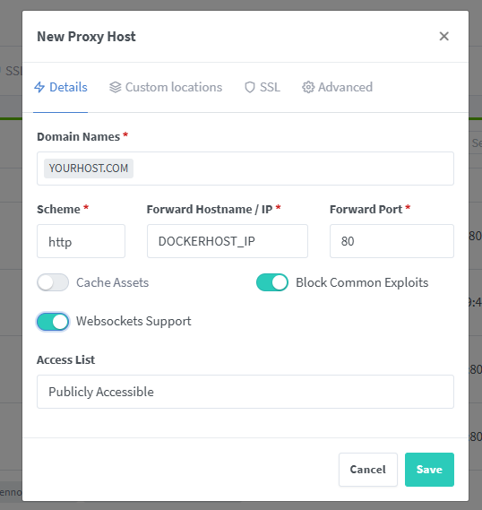
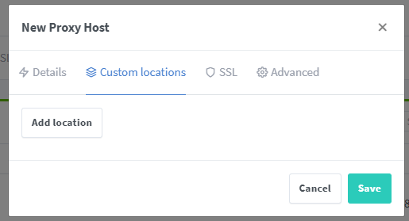
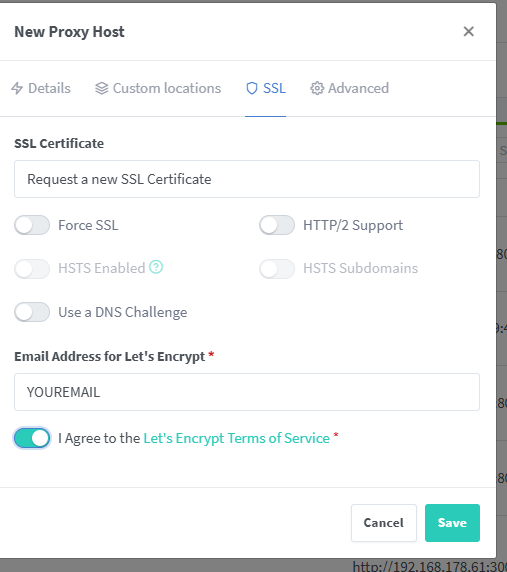
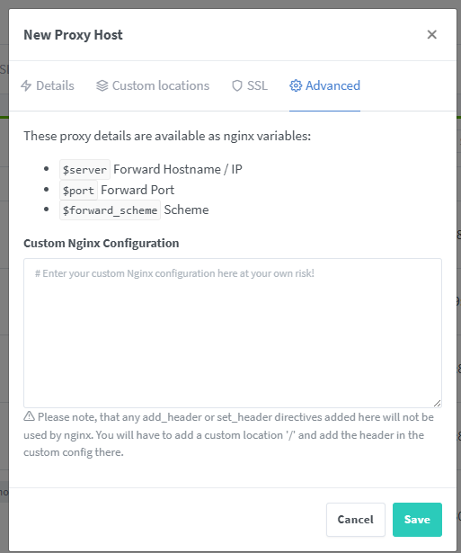

# Official Guide to host in Docker with Nginx Proxy Manager

This is an official Guide to host YAGPDB in Docker, with an external Nginx Proxy Manager installed, with an Domain.

## Create and configure Discord Bot

First, go to [https://discord.com/developers/applications](https://discord.com/developers/applications), then click on "New Application". 
Type in your Bot Name, click on the little Checkbox and click on Create.

Add your Icon if you want an Icon.

Go to OAuth2, and follow these Steps:
1. Click on Client ID: Copy (Save this for later)
2. Click on Client Secret: Reset Secret (Save this for later)
3. Click 2 Times on Add Redirect
 1. https://YOURHOST.COM/confirm_login
 2. https://YOURHOST.COM/manage

Now go to Bot and follow these Steps:
1. Click on Reset Token (Save this for later)
2. Click on these Privileged Gateway Intents:
 1. Presence Intent
 2. Server Members Intent
 3. Message Content Intent

## Install required packages

```shell
apt update
apt install docker.io docker-compose git
```

## Clone Repository and copy neccasary Files

```shell
git clone https://github.com/botlabs-gg/yagpdb
cp yagpdb/yagpdb_docker/{app.example.env,app.env}
cp yagpdb/yagpdb_docker/{db.example.env,db.env}
```

## Edit app.py
```shell
cd yagpdb/yagpdb_docker
nano app.env
```
Now edit these Settings:
1. YAGPDB_OWNER: To your UserID (https://support.discordapp.com/hc/en-us/articles/206346498-Where-can-I-find-my-User-Server-Message-ID-)
2. YAGPDB_CLIENTID: Your OAuth Client ID that you saved
3. YAGPDB_CLIENTSECRET: Your OAuth Client Secret that you saved
4. YAGPDB_BOTTOKEN: Your Bot Token that you saved
5. YAGPDB_HOST + VIRTUAL_HOST + LETSENCRYPT_HOST: YOURHOST.COM
6. Comment these Lines with # (Except you want the Plugins to be enabled):
 1. 36-39
 2. 42
 3. 51-54
 4. 57
 5. 61
7. YAGPDB_EMAIL + LETSENCRYPT_EMAIL: Your Email

## Edit docker-compose.yml

```shell
nano docker-compose.yml
```

Here is the full File:

```shell
version: '3'

volumes:
  db:
  redis:
  cert_cache:
  soundboard:

networks:
  default:

services:
  app:
    # We don't provide an official image, but there is a community-made image you can try:
    #  - teyker/yagpdb (https://hub.docker.com/r/teyker/yagpdb)
    #
    # Note that we do not take responsibility for anything that happens as a result of using
    # the image above.
    image: teyker/yagpdb
    restart: unless-stopped
    command:
      # - "/app/yagpdb"
      - "-all"
      - "-pa"
      - "-exthttps=true"
      - "-https=false"
    depends_on:
      - redis
      - db
    networks:
      - default
    volumes:
      - cert_cache:/app/cert
      - soundboard:/app/soundboard
    ports:
      - '80:80'
      - '443:443'
    env_file:
      - app.env

  redis:
    image: redis
    restart: unless-stopped
    networks:
      - default
    volumes:
      - redis:/data

  db:
    image: postgres:11
    restart: unless-stopped
    volumes:
      - db:/var/lib/postgresql/data
    networks:
      - default
    env_file:
      - db.env
```

## Start the Docker Image

For the first Run the check for Errors / Warnings:
```shell
docker-compose -f docker-compose.yml up
```

After the first Run:
```shell
docker-compose -f docker-compose.yml up -d
```

## Configure Nginx Proxy Manager

Go to your NGM UI and create an new Host under Hosts > Proxy Hosts > Add Proxy Host
Make sure the configure your Router that your NGM gets exposed under the 443 Port.









To get DOCKERHOST_IP, run
```shell
ip addr
```
in your Host, where you hosted YAGPDB.
Now click on Save.

Visit YOURHOST.COM to see if it worked!
